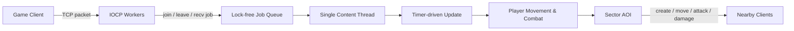

# MMOFighter IOCP Server

> 다수 플레이어의 이동·전투·관심 영역을 하나의 콘텐츠 흐름에서 갱신하는 2D 액션 게임 서버

`C++20` · `Windows` · `TCP / IOCP` · `Game Loop` · `Sector AOI` · `Object Pool`

## 프로젝트 한눈에 보기

| 항목 | 내용 |
|---|---|
| 장르 모델 | 2D 횡스크롤형 실시간 전투 |
| 네트워크 | Windows IOCP 기반 비동기 TCP |
| 콘텐츠 경계 | 네트워크 callback을 job queue에 넣고 단일 콘텐츠 thread가 상태 변경 |
| 플레이 | 8방향 이동, 이동 정지, 3종 공격, 피격·HP, echo |
| 가시성 | 현재 섹터를 포함한 최대 3×3 주변 섹터 |
| 상태 관리 | Player map, sector set, TLS object pool, 직렬화 packet pool |

## 런타임 흐름

네트워크 I/O와 게임 상태 변경을 분리해, 플레이어 map과 섹터 집합을 콘텐츠 thread에서 순차적으로 다루는 구조를 실험했습니다.

## 핵심 구현

### 1. 게임 loop와 job 직렬화

- 접속·종료·수신 callback은 `Job`으로 변환되어 queue에 들어갑니다.
- 콘텐츠 thread가 update와 packet job을 처리해 상태 변경 지점을 한곳에 모읍니다.
- 관련 구현: [`MMOServer.cpp`](MMOFighter_IOCP_Server/MMOServer.cpp)

### 2. 이동과 좌표 동기화

- 8방향 이동 상태를 timer-driven update에서 월드 경계 안으로 갱신합니다.
- 클라이언트 좌표와 서버 좌표의 차이가 허용 범위를 넘으면 sync packet을 보냅니다.
- 이동 시작·정지와 echo packet은 [`Protocol.h`](MMOFighter_IOCP_Server/Protocol.h)에 정의되어 있습니다.

### 3. 3종 공격과 피격 판정

| 공격 | 특성 |
|---|---|
| Attack 1 | 짧은 범위·낮은 피해 |
| Attack 2 | 중간 범위·중간 피해 |
| Attack 3 | 넓은 범위·높은 피해 |

방향, X/Y 범위와 주변 섹터의 플레이어를 기준으로 피해 대상을 찾고 HP 및 damage packet을 갱신합니다.

### 4. 섹터 AOI

- 월드 좌표를 고정 크기 sector로 나누고 주변 최대 9개 sector만 탐색합니다.
- sector 경계를 넘을 때 remove/add 영역 차이를 계산합니다.
- 새 관심 영역에는 캐릭터 생성·이동 packet을, 벗어난 영역에는 삭제 packet을 보냅니다.

### 5. 메모리와 관측

- Player와 packet을 pool에서 재사용하고 세션별 send queue를 둡니다.
- 별도 monitoring thread가 queue, packet, player와 network 처리 지표를 콘솔에 집계합니다.

## 코드 탐색

| 경로 | 설명 |
|---|---|
| [`MMOFighter_IOCP_Server.sln`](MMOFighter_IOCP_Server.sln) | Visual Studio solution |
| [`MMOServer.cpp`](MMOFighter_IOCP_Server/MMOServer.cpp) | game loop, 이동, 공격, AOI |
| [`NetServer.cpp`](MMOFighter_IOCP_Server/NetServer.cpp) | IOCP session·send/recv 처리 |
| [`Player.h`](MMOFighter_IOCP_Server/Player.h) | 플레이어 위치·방향·HP 상태 |
| [`Sector.h`](MMOFighter_IOCP_Server/Sector.h) | AOI 좌표 자료형 |
| [`SerializingBuffer.cpp`](MMOFighter_IOCP_Server/SerializingBuffer.cpp) | packet 직렬화와 encoding |

## 빌드 및 실행 전제

- Visual Studio 2022 toolset `v143`, Windows 10 SDK, C++20
- WinSock2와 Windows multimedia timer
- [`MMOServer.txt`](MMOFighter_IOCP_Server/MMOServer.txt)의 bind·worker·session 설정을 환경에 맞게 교체
- solution을 x64로 빌드한 뒤 호환되는 game client 또는 packet test client 필요

> 현재 저장소에는 자동화된 client·CI·재현 benchmark가 없어 실제 동시 접속 규모나 지연시간을 수치로 보장하지 않습니다.

## 현재 상태

2024년 게임 서버 학습 시점의 레거시 기준선입니다. 콘텐츠 thread의 유휴 대기가 현재 busy-spin인 점과 authoritative 좌표 검증, AOI 좌표 정확성, timeout·종료 수명, packet 경계 검사를 우선 현대화 대상으로 관리하고 있습니다.

포트폴리오 연계 저장소: [LoginServer](https://github.com/ldcity/LoginServer) · [ChattingServer](https://github.com/ldcity/ChattingServer) · [MonitoringServer](https://github.com/ldcity/MonitoringServer)
